# SAVI Frontend

## Application Overview

SAVI stands for **S**ensor **A**pplication & **V**isualization **I**nterface. This is the Vue frontend for the SAVI system. It lets users log in, lay out and configure sensors/devices on a canvas, start and monitor recipe runs, view live sensor charts, and manage users and settings.

The frontend is a Vue 3 application that:

- Connects to the SAVI backend's REST API for auth, device/sensor configuration, settings, and run/recipe management.
- Connects to the backend's SignalR hub to receive live sensor updates, device logs, and run state changes.
- Stores the logged in user's auth token in `sessionStorage`, so a session lasts for the tab but doesn't persist across browser restarts.

## How to Install / Run

**Prerequisites:**

- [Node.js](https://nodejs.org/) 20 or later, CI runs on Node 24.
- The SAVI backend running and reachable (see the backend's own README for how to start it). The frontend will load without it, but most features need it.

**Install dependencies:**

```bash
npm install
```

**Run the dev server:**

```bash
npm run dev
```

This starts Vite's dev server on `http://localhost:5173`

**Other scripts:**

| Command              | Purpose                                                                             |
| -------------------- | ----------------------------------------------------------------------------------- |
| `npm run build`      | Builds the production bundle into `dist/`.                                          |
| `npm run preview`    | Serves the built `dist/` output locally, for a quick sanity check before deploying. |
| `npm test`           | Runs the test suite once with Vitest.                                               |
| `npm run test:watch` | Runs the test suite in watch mode while you work.                                   |

## Configuration

The backend URL isn't baked into the build. It's read at startup from a plain JSON file:

[`public/config/settings.json`](public/config/settings.json):

```json
{
  "backendUrl": "http://localhost:5176"
}
```

`src/main.js` fetches this file before mounting the app, then makes the value available to every component via Vue's `inject` under the key `BACKEND_URL`.

## How to use the front-end:

If you don't want to run the front-end on your local machine then you can go to this link: https://lively-stone-078e6b90f.7.azurestaticapps.net/

If you want to run this on your machine then go to this link: http://localhost:5173/

The first screen that you will see when you log in will be:

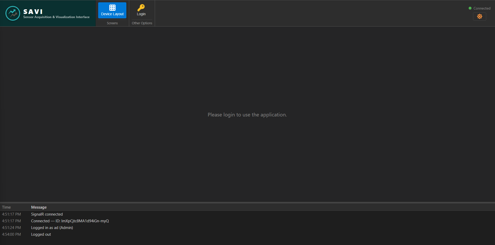

Click the "Login" button and a dialog box will appear:
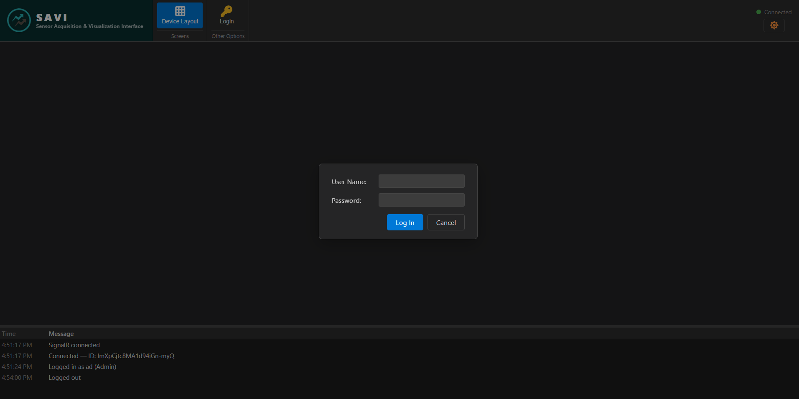

Enter this default username and password:

Username: admin

Password: Admin@2026!

This is the seed admin account the backend creates automatically on first run (see the backend's `SeedAdmin` config). It's for demonstration purposes only, so change or remove it before any real deployment.

When you login you will see all the options available:
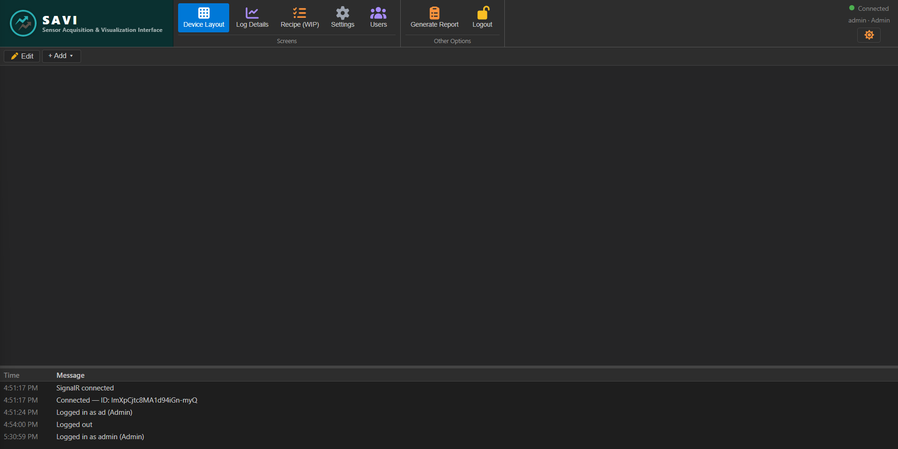

Click the "Add" button:
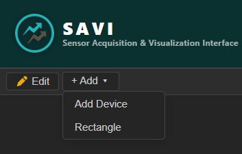

Click the "Rectangle" button: (The rectangle is meant for separating multiple devices as you will see later)
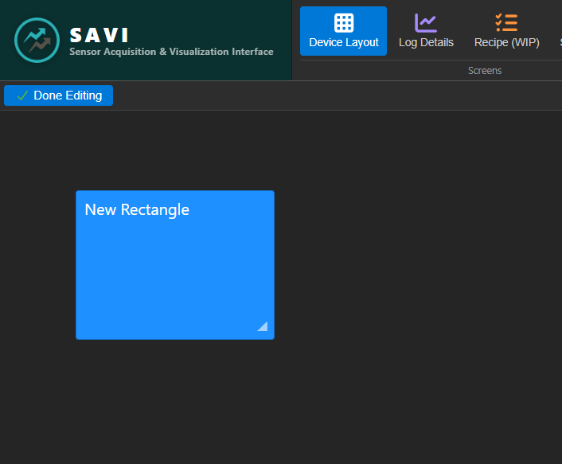
After you insert the rectangle you will notice that you are in editing mode. This will allow you to move the rectangle by clicking and dragging it. You can also resize it by clicking and draging on the small triangle in the bottom right. You will also notice that when you click the rectangle you will have the ability to change these about the rectangle:
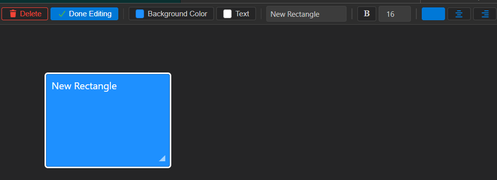

Click the "Done Editing" button when you are done modifying the rectangle:
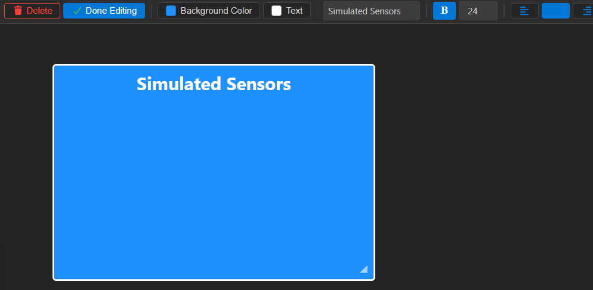

Next let's add a simulated sensor, click the add button again then click the "Add Device" button:


Give a display name for the sensor, keep it simulated, then add both a relay and a collision detector:
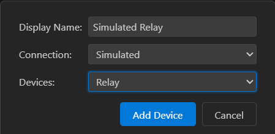
Just like the Rectangle if you click the sensors you can move then when clicking and dragging, change the color and change the color of the text. This is what I did with mine:
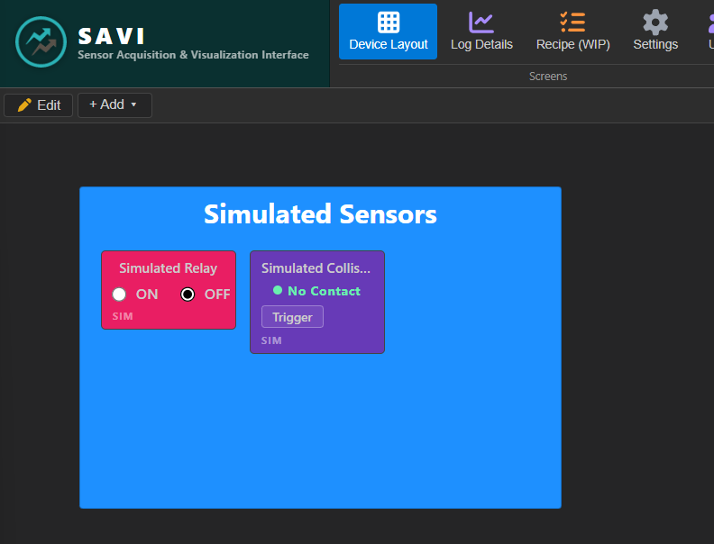

You will see that there are options for the simulated relay, where it will allow you to turn on and off the relay and tell you in the message box at the bottom when you turned it on and off. At the bottom left, you will see the text that says "SIM" that means this sensor is a simulated device and you won't be controlling anything in the real world. If you set up the raspberry PI and hooked up a relay then you will have to enter the pin # and when you click ON/OFF then it will control the relay. For the simulated collision detector you will see a trigger button that will change the text, for a real device clicking in the collision sensor will change the text.

If you look at the top right of the application you will see if you're connected to the backend, who is logged in, and there is an option to switch between light and dark mode:
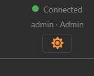

Click on "Log Details" and this will be what you will see:
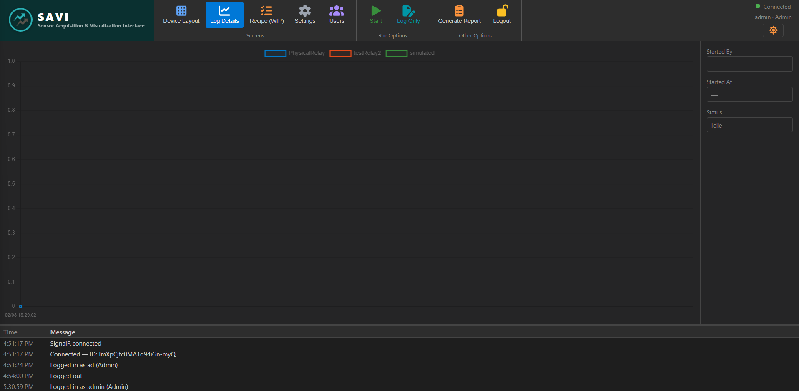

This screen lets you start recipes which will record data while its running, or have a logging mode where data is being collected while you control the hardware/sim devices manually.

Click the "Start" button:
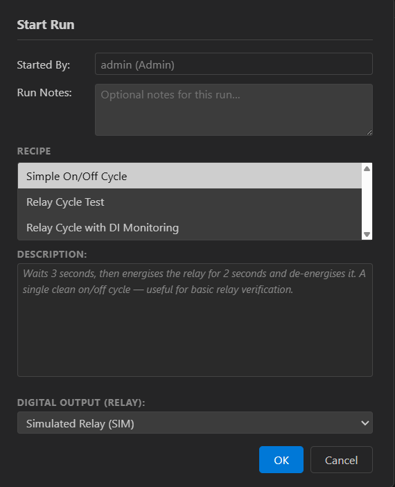

You will see who is starting the run, a spot to enter notes for the run and 3 different recipes that you can run with description. At the bottom you will see an "OK" button to start the run and can watch the graph while the recipe is running.

Click the "Log Only" button:
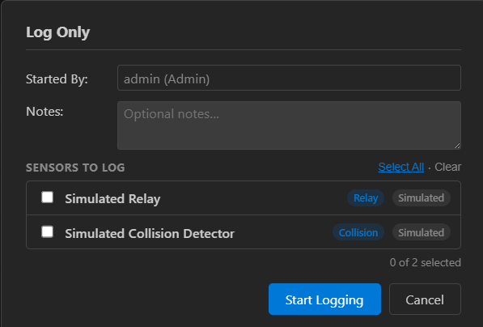

You will see again who is starting to log, an area for notes, and sensors to select from for logging. Select what you want to log and then control the sensors in the device layout and they will be picked up in the log. When you start the log you will have the option to pause the logging or to stop the logging as well:
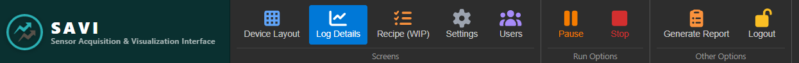

Now you can look at that report. Click the "Generate Report" button.
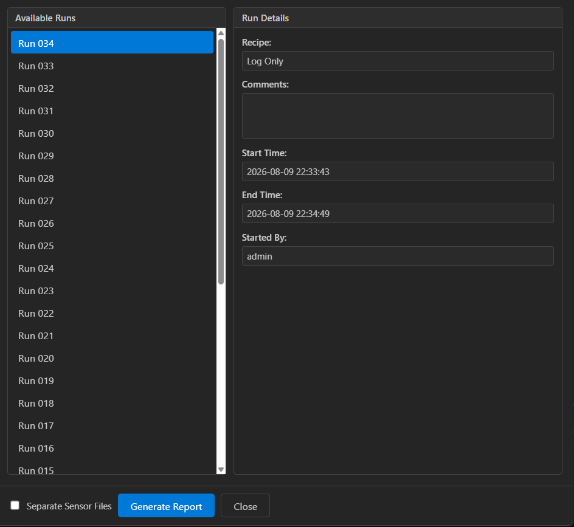

You will see all the runs that you have done as well as details per run. At the bottom of the dialog you will see the generate button where the file will download with the sensor data. If you select the option for separate sensor files then you will get the data from each sensor in it's own file instead of all the data combined into one file.

The Recipe button isn't finished yet and is labeled WIP so next click the "Settings Button":
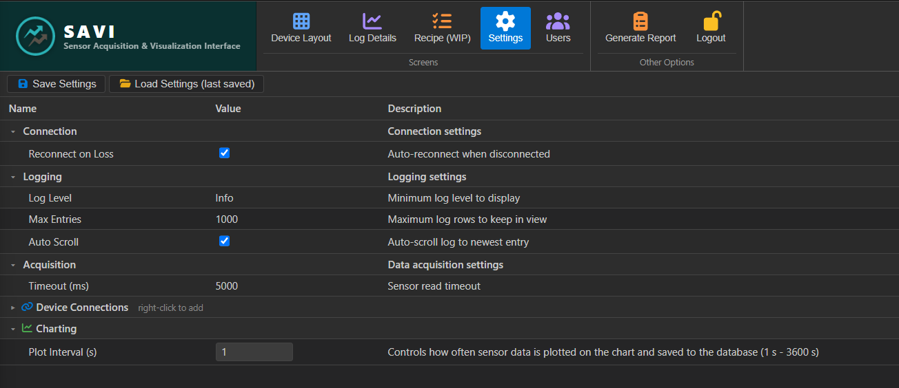

For the logging section you can change the max entries in the bottom menu that are shown and have the option to autoscroll that box so you can see the latest entry or not. Then there is a section to add the devices (raspberry PI) that you can connect to. You can do this by right clicking the Device Connections and adding the IP address.
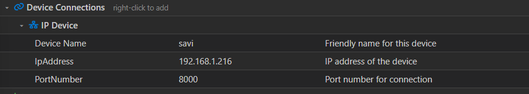

If you double click the value column you can edit the rows, you can delete the device connections by right clicking the "IP Device" and selecting delete.

In the charting section there is one option that allows you to change the interval for the data being collected. This also controls the rate at which data is collected.

After making changes make sure that you click the "Save Settings" button at the top left of the screen.

Now the users screen if you are logged in as someone who has access to it. Click the "Users" button:
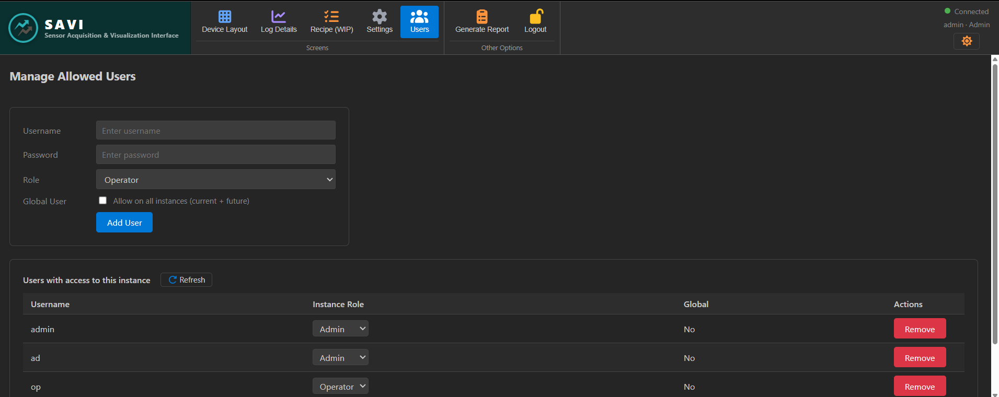

This screen is for adding new users and managing them by being able to remove them or change their access level. There is a global option as well, but that would be for if this database was in the cloud and have that user being able to sign into different instances as well. 

When you are done you can click the "Logout" button which will take you back to the screen that you saw when going to the application for the first time.

## Architecture Overview

```
src/
  main.js            Entry point. Loads runtime config, registers FontAwesome,
                      mounts the app with the backend URL provided app wide.

  App.vue            Root component. Owns essentially all app state (SignalR
                      connection, auth, run state, devices, log entries, theme,
                      dialogs)

  App.css            Global styles and theme CSS variables.

  auth/
    roles.js         Permissions enum and the single role gating helper 
                        used across the app.

  constants/
    chart.js         Chart palette.
    colors.js        The app's color palette, also pushed into CSS variables.
    devices.js       Item types, device property definitions
                      used by the device layout canvas.
    enums.js         Shared enums: log levels, run status, connection status,
                      run commands, view names.

  components/
    AppRibbon.vue    Top toolbar: view switching, run controls, theme toggle.
    LogPanel.vue     Bottom log panel, color coded by severity.
    *Dialog.vue      Login, add sensor, start run, log only, report dialogs.
    SensorTile.vue, RectTile.vue   Tiles placed on the device layout canvas.

    views/
      DeviceLayout.vue       Main canvas for placing and configuring devices.
      LoggingDetails.vue     Live chart fed by SignalR and polling.
      DeviceConnections.vue  Device and connection management.
      Settings.vue           App settings, persisted through the backend.
      Users.vue              Admin only user management.
      Recipe.vue             Recipe editing. WIP not finished yet.
```

Here is a diagram of the application flow, created using draw.io. The editable `.drawio` source file lives in [`docs/diagrams/`](docs/diagrams/) in this repo:

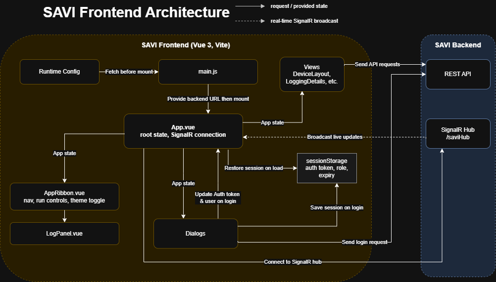

## Testing / CI Pipeline

Tests are written with [Vitest](https://vitest.dev/) and [`@vue/test-utils`](https://test-utils.vuejs.org/), configured through the `test` block in [`vite.config.js`](vite.config.js).

CI is defined in [`.github/workflows/ci.yml`](.github/workflows/ci.yml) and runs on every push and pull request targeting `main`. It checks out the repo, sets up Node 24, runs `npm ci`, then `npm run build`, then `npm test`.

### Testing the CI Pipeline Locally

Before pushing, you can validate the `ci.yml` workflow itself, catching syntax mistakes or job config errors without waiting on a real GitHub Actions run.

**Prerequisites:**

- Docker Desktop installed and running:
  
  ```powershell
  winget install Docker.DockerDesktop
  ```

- [`actionlint`](https://github.com/rhysd/actionlint), which checks the workflow YAML for syntax errors

- [`act`](https://github.com/nektos/act), which runs GitHub Actions workflows locally in a container:
  
  ```powershell
  winget install nektos.act
  ```

**1. Lint the workflow file:**

```bash
actionlint .github/workflows/ci.yml
```

If there's no output after running it, everything looks good, no syntax problems found.

**2. Dry run the job:**

GitHub runs this workflow on `ubuntu-latest` so:

```bash
act push -j build-and-test --dryrun -P ubuntu-latest=catthehacker/ubuntu:act-latest
```

This doesn't actually execute the install/build/test steps. It verifies the trigger, job, and step definitions all resolve correctly, so you catch a broken workflow file before pushing to GitHub.

## Deployment

The app deploys to **Azure Static Web Apps** via [`.github/workflows/azure-static-web-apps.yml`](.github/workflows/azure-static-web-apps.yml).

- On every push to `main`, the workflow builds and deploys the app using the official `Azure/static-web-apps-deploy` action.

- This requires an `AZURE_STATIC_WEB_APPS_API_TOKEN` repository secret. The built in `GITHUB_TOKEN` is used automatically.
